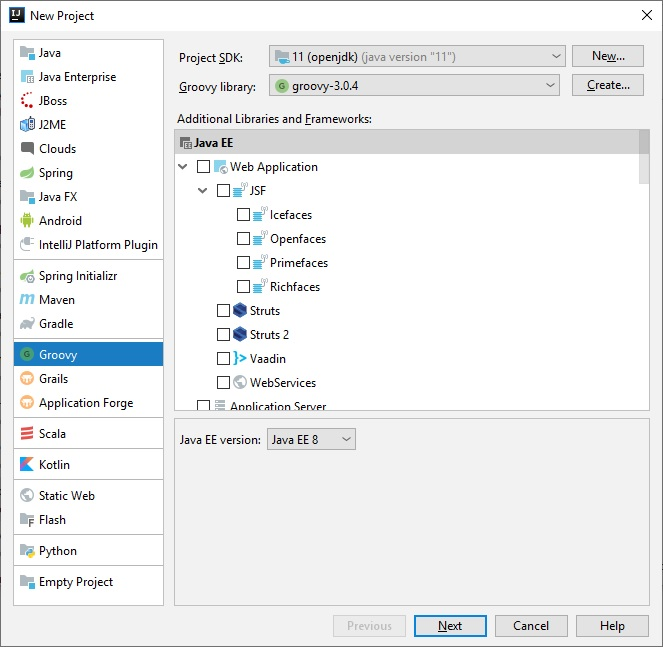

# Groovy Basics

## Getting Started

Groovy is a language developed from apache which is actually java in steroids. It is [Optionally typed](https://www.quora.com/What-are-typed-language), JVM based, dynamic language. Originally while learning groovy I believed that developers who created this language were java developers who were bored typing. After checking the documentation i figured out that they were bored typing code but loved writing documentation. Simply put Groovy has the following core characteristics:

1. Powerful features missing from Java like Closures, runtime and compile-time meta-programming, actual object oriented programming and actual functional programming support and type inference
2. Smooth  java integration (groovy can use java classes and java classes can use groovy)
3. Rich ecosystem to build web applications, reactive applications, test frameworks, etc
4. Perfect tool for writing concise and maintainable (automation) tests

### Installation (on windows)

- [ ] Install Java

- Download and setup java 11 from [here](https://jdk.java.net/) 

- Click <win>+<break or pause> to open Control Panel\All Control Panel Items\System


- Click advanced System Settings and then environment variables


- In System variables set as JAVA_HOME the path where java is installed.

- In PATH variable that already exists, add the bin directory of java as follows %JAVA_HOME%/bin

- [ ] Install Groovy

- Download Groovy from the [groovy site](https://groovy.apache.org/download.html)

- Similar to java open environment variables and set the GROOVY_HOME and also add in PATH the %GROOVY_HOME%/bin

  
  
  
  
  - [ ] [Install Intellij](https://www.jetbrains.com/idea/download/#section=windows) and add groovy plugin by following instructions from [here](https://www.jetbrains.com/help/idea/managing-plugins.html) and as plugin try to find the one named Groovy
  - [ ] 

### Resources

[Apache Groovy Documentation](http://groovy-lang.org/)

### Groovy Console and Groovy shell

After having installed Groovy and having added it to windows path you may enter the groovy shell  by typing 
/> groovysh

There one can type/execute groovy language 


Magnificent tool! We won't use it.

The other tool that we have, is 

/>groovyconsole

Yet another tool that we will not use. However working with it is made easier if one selects Auto Clear Output On Run. Also Script->Inspect AST can say a lot of things to developers about how Groovy works on top of Java. Why we will be avoiding working with these two tools? Because we will be using an IDE like intelliJ.


### IntelliJ Project setup

After installing Intellij, select "Create New Project" and then select Groovy with java 11 and then select next/finish after setting your project's path and name.



In Project structure, move to libraries and select to add a new Java project library which is located at the following path: 

<groovy instalaltion path>/lib/extras-jaxb

Lets now test this by creating in src folder a package named test and then a class named groovy script  named Test. 


Inside the script and after the package name please type:

```groovy
println "hello world"
```

Then execute the script

If everything is correct the project should write to the console the message `Hello World`

## Java VS Groovy

Consider the following **java** class where we have a user with a set of properties, getters/setters, equals/hashcode/toString methods and lets try to convert it to groovy.

```java
package test.javaAndGroovy;

import java.util.Date;
import java.util.List;
import java.util.Objects;

public class User {
    private String firstName;
    private String lastName;
    private String email;
    private int age;
    private Date dob;
    private List<User> friends;
    private List<User> family;
    private List<User> coWorkers;

    public User() {
    }

    public User(String firstName, String lastName, int age) {
        this.firstName = firstName;
        this.lastName = lastName;
        this.age = age;
    }


    public User(String firstName, String lastName, String email, int age,
                Date dob, List<User> friends, List<User> family, List<User> coWorkers) {
        this.firstName = firstName;
        this.lastName = lastName;
        this.email = email;
        this.age = age;
        this.dob = dob;
        this.friends = friends;
        this.family = family;
        this.coWorkers = coWorkers;
    }

    public String getFirstName() {
        return firstName;
    }

    public void setFirstName(String firstName) {
        this.firstName = firstName;
    }

    public String getLastName() {
        return lastName;
    }

    public void setLastName(String lastName) {
        this.lastName = lastName;
    }

    public String getEmail() {
        return email;
    }

    public void setEmail(String email) {
        this.email = email;
    }

    public int getAge() {
        return age;
    }

    public void setAge(int age) {
        this.age = age;
    }

    public Date getDob() {
        return dob;
    }

    public void setDob(Date dob) {
        this.dob = dob;
    }

    public List<User> getFriends() {
        return friends;
    }

    public void setFriends(List<User> friends) {
        this.friends = friends;
    }

    public List<User> getFamily() {
        return family;
    }

    public void setFamily(List<User> family) {
        this.family = family;
    }

    public List<User> getCoWorkers() {
        return coWorkers;
    }

    public void setCoWorkers(List<User> coWorkers) {
        this.coWorkers = coWorkers;
    }

    @Override
    public boolean equals(Object o) {
        if (this == o) return true;
        if (o == null || getClass() != o.getClass()) return false;
        User user = (User) o;
        return age == user.age &&
                Objects.equals(firstName, user.firstName) &&
                Objects.equals(lastName, user.lastName) &&
                Objects.equals(email, user.email) &&
                Objects.equals(dob, user.dob) &&
                Objects.equals(friends, user.friends) &&
                Objects.equals(family, user.family) &&
                Objects.equals(coWorkers, user.coWorkers);
    }

    @Override
    public int hashCode() {
        return Objects.hash(firstName, lastName, email, age, dob, friends, family, coWorkers);
    }
}
```


- [ ] Lets start by copying the file User.java to a file named User2.goorvy

Next lest start by following some steps:

1. Remove imports. In Groovy most of the commonly used packages are imported by default.\
   - java.io.*
   - java.lang.*
   - java.math.BigDecimal
   - java.math.BigInteger
   - java.net.*
   - java.util.* (which includes `Collection`)
   - groovy.lang.*
   - groovy.util.*
2. Access modifier `public` in class is not needed. All classes are public by default
3. `private` access modifier is not needed in class properties. All class properties are by default private
4. Getters and setters are also not needed. These are automatically created by default. 
5. The various constructors are not needed. We can use named arguments to create an instance of the DTO duw to the existence of the `Map` argument constructor. 
6. We can remove the ToString and the Equals/Hashcode by adding the corresponding annotations to the class.
7. We can remove the semicolons, as these are not needed
8. In methods return keyword is not needed. The last line is what is returned.

The end class in Groovy is as follows:

```groovy
package test.javaAndGroovy

import groovy.transform.EqualsAndHashCode
import groovy.transform.ToString;

@ToString(includePackage = false, includeNames = true)
@EqualsAndHashCode
class User2 {
    String firstName
    String lastName
    String email
    int age
    Date dob
    List<User> friends
    List<User> family
    List<User> coWorkers
}
```


Lets now create a script to test this class.

```groovy
package test.javaAndGroovy

User user=new User("Alexandros", "Rongas", 40)
println user


User2 user2=new User2(firstName: "Alexandros", lastName: "Rongas", age: 40)
println user2
```


- [ ] We can see that in our example we can use both java and groovy classes
- [ ] We can see the use of map argument contractor.

## Language Basics

### Keywords, Imports and Comments

- [ ] Groovy  uses all the keywords of java plus some of it's own. These can be found in the documentation of groovy at the groovy site.

- [ ] Imports in Groovy are exactly same as in Java with only one difference. Groovy has a list of default imports which one does not need to import in his project.

- [ ] Comments in Groovy are similar as in java. Only addition is shebang line comment

  `#!/usr/bin/env groovy`

### Scripts and Classes

- [ ] In groovy we can have classes similar to java but also we can also have scripts. A script is any groovy code which is not enclosed in a class.
- [ ] A script can contain classes
- [ ] In groovy, in the same file many classes can be included
- [ ] A class file does not necessary need to have the same name as a class
- [ ] A script actually generates a class named after the file name. For this reason a class inside a script cannot have the same name as the name of the script file

#### Grapes

An application or a script may have dependencies. Using Grape functionality a script can download dependencies. Simply put, grape lets you quickly add maven repository dependencies to your classpath, making scripting even easier. The simplest use is as simple as adding an annotation to your script:


```groovy
package test.language.basics.classes1.grapes

@Grab(group = 'org.apache.commons', module='commons-lang3', version = '3.11')
import org.apache.commons.lang3.StringUtils


List<String> languages=[]
languages << "Java"
languages << "Groovy"
languages << "Angular"

println StringUtils.join(languages,",")
```


### Simple Data Types

Primitive data types in java:

```java
// byte: Min Value: -128, Max Value: 127
byte b = 10;

// short: Min Value: -32,768, Max Value: 32,767
short s = 10000;

// int: Min Value: -2,147,483,648 (-2^31), Max Value 2,147,483,647 (2^31 - 1)
int i = 2_147_483_647;

// long: 
// Min Value: -9,223,372,036,854,775,808 (2^63), 
// Max Value: 9,223,372,036,854,775,807 (2^63 – 1)
long l = 100342342342342324L;

// float: 32-bits IEEE floating points (single precision)
// Min Value: 1.4E-45
// Max Value: 3.4028235E38
float f = 1.25F;

// double:64-bit IEEE floating points (double precision)
// Min Value: 4.9E-324
// Max Value: 1.7976931348623157E308
double d = 1.25;

// char: character or unicode
char c = 'c';

// boolean: true or false
boolean bool = false;
```


```groovy
package test.language.basics.data.types.primitive

int x=5;
println x.class.getName()

float z=4F
println z.getClass().getName()

def y = 5;
println y.getClass().getName();

y="This is a string?"
println y.getClass().getName();

1.intdiv(4)

```


- [ ] primitive data types in java are not first class citizens.  Classes and Objects are

Converting Data Types can be done via:

- Casting

- Coercion

  > Note: 1/2 is transformed into BigDecimal in Groovy so unlike java is not 0

- GDK methods aka toInteger(), isNumber(), toBoolean(), etc

There are some commonly used methods with numbers which are often found handy:

- times()
- upto()
- downto()
- step()

```groovy
20.times {
    print '-'
}

1.upto(10) { num ->
    println num
}

10.downto(1) { num ->
    println num
}

0.step(1,0.1) { num ->
    println num
}
```

### Operators

(http://groovy-lang.org/operators.html)

- Arithmetic Operations:


| Operator |  Purpose    |   Remarks   | Assignment form |
| -------- | ---- | ---- | -------- |
| + | Add |      | += |
| - | Substract |      | -= |
| * | Multiply |      | *= |
| / | Divide | Use `intdiv()` for integer division | /= |
| % | Remainder |      | %= |
| ** | Power | Return types can be found [here](https://docs.groovy-lang.org/latest/html/documentation/core-syntax.html#power_operator) | **= |


```groovy
// Arithmetic operators
assert 10 + 1 == 11
assert 10 - 1 == 9
assert 10 * 2 == 20
assert 10 / 5 == 2
assert 10 % 3 == 1
assert 10 ** 2 == 100
```


- Comparison operators:


| Operator |  Description    |
| -------- | ---- |
| ==       | Check equality |
| !=       | Check inequality |
| >        | Greater than |
| >=       | Greater or equal than |
| <        | Less than |
| <=       | Less or equal than |


```groovy
assert 1 + 2 == 3
assert 3 != 4
assert -2 < 3
assert 2 <= 2
assert 5 > 1
assert 5 >= -2
```


- Logical operators:


| Operator | Description |
| -------- | ----------- |
| !        | Negation    |
| &&       | Logical And |
| \|\|     | Logical Or  |


```groovy
assert !false
assert true && true
assert true || false
```

- Ternary Operator:


```groovy
String s = ""
result = ( s != null && s.length() > 0 ) ? 'Found' : 'Not Found'
displayName = user.name ? user.name : 'Anonymous'
displayName = user.name ?: 'Anonymous'
```

- Method pointer operator:

The method pointer operator (`.&`) can be used to store a reference to a method in a variable, in order to call it later:

```groovy
def str = 'example of method reference'            
def fun = str.&toUpperCase                         
def upper = fun()                                  
assert upper == str.toUpperCase()     
```

- Method reference operator:

```groovy
assert 6G == [1G, 2G, 3G].stream().reduce(0G, BigInteger::add)  
```

#### Operator Overloading

Unlike java we can overload operators in Groovy. This is a very nice feature. 

Lets consider we have a class named Bag and two instance objects (bag1, bag2) of the Bag.  What we wish to accomplish is that bag1+bag2 returns a bag with the contents of the two bags together. This can be done with operator overloading.


```groovy
package test.language.basics.operators

import groovy.transform.ToString

@ToString
class Bag{
    List<String> items=[]

    Bag plus(Bag other){
        new Bag(items:other.items+this.items)
    }

}

Bag bag1=new Bag()
bag1.items << 'USB stick'
bag1.items << 'Keys'
Bag bag2=new Bag()

bag2.items << 'Mouse'
bag2.items << 'Keyboard'

println bag1+bag2
```


### The Groovy Truth

- Non-empty Collections and arrays are true.

```groovy
assert [1, 2, 3]
assert ![]
```

- Iterators and Enumerations with further elements are coerced to true.


```groovy
assert [0].iterator()
assert ![].iterator()
Vector v = [0] as Vector
Enumeration enumeration = v.elements()
assert enumeration
enumeration.nextElement()
assert !enumeration
```

- Non-empty Maps are evaluated to true.


```groovy
assert ['one' : 1]
assert ![:]
```

- Non-empty Strings, GStrings and CharSequences are coerced to true.

```groovy
assert 'a'
assert !''
def nonEmpty = 'a'
assert "$nonEmpty"
def empty = ''
assert !"$empty"
```

- Non-zero numbers are true.


```groovy
assert 1
assert 3.5
assert !0
```

- Non-null object references are coerced to true.


```groovy
assert new Object()
assert !null
```

### Strings

Strings in Groovy are similar to java with some extensions though:

- We can use "text" or 'text' to denote a string. 
- Groovy lets you instantiate `java.lang.String` objects, as well as GStrings (`groovy.lang.GString`) which are also called *interpolated strings*
- Triple quoted strings are defined where multiline strings can be defined.
- `Slushy` and `Dollar Slushy` strings helps with String escaping


```groovy
package test.language.basics.operators

def c2 = 'c'
println c2.class

def str2 = 'this is a string'
println str2.class

String name="Alex"

def str3 = "this is a string ${name}"
println str3.class


String msg2 = "Hello ${name}"
println msg2

String msg3 = 'Hello ${name}'
println msg3

String msg4 = "We can evaulate expressions here: ${1 + 1}"
println msg4

// multiline strings

def aLargeMsg = """
A 
Msg
goes 
here and 
keeps going ${1+1}
"""


def aLargeMsg2 = '''
A 
Msg
goes 
here and 
keeps going ${1+1}
'''

println aLargeMsg

// slashy
def folder = /C:\groovy\dan\foo\bar/
println folder

// dollar slashy
def folder2 = $/C:\groovy/\dan\foo\bar/$
println folder


def date = "April, 1st"

def dollarSlashy = $/
    Hello $name,
    today we're ${date}.

    $ dollar sign
    $$ escaped dollar sign
    \ backslash
    / forward slash
    $/ escaped forward slash
    $$$/ escaped opening dollar slashy
    $/$$ escaped closing dollar slashy
/$
println dollarSlashy

```


### Controls

#### Conditional

- if statements as these are in java

  ```groovy
  // if( boolean expression ) { //logic }
  
  if( true ) {
      println "true"
  }
  
  if( true )
      println true
  
  def age = 35
  if( age >= 35 ){
      println "can run for president"
  }
  
  if( false ) {
      println "true"
  } else {
      println "false"
  }
  
  def yourage = 18
  if( yourage >= 21 ) {
      println "buy beer"
  } else {
      println "no beer for you"
  }
  
  def someage = 37
  
  if( someage >= 21 && someage < 35 ) {
      println "buy some beer"
  } else if( someage >= 35 ) {
      println "run for president"
  } else {
      println "under 21..."
  }
  ```

  

- Ternary operator remains as is but it is extended with Elvis operator

  ```groovy
  def name = 'Dan'
  def isitdan = (name.toLowerCase() == 'DAN') ? 'YES' : 'NO'
  println isitdan
  
  def msg
  def output = (msg != null) ? msg : 'default message...'
  
  def elvisOutput = msg ?: 'default message...'
  
  println msg
  println output
  println elvisOutput
  ```

- Switch statements are extended

  ```groovy
  def num = 12
  
  switch( num ) {
      case 1 :
          println "1"
          break
      case 2 :
          println "2"
          break
      case 1..3 :
          println "in range 1..3"
          break
      case [1,2,12] :
          println "num is in list [1,2,12]"
          break
      case Integer :
          println "num is an Integer"
          break
      case Float :
          println "num is a float"
          break
      default :
          println "default..."
  }
  
  ```

  

- in operator is introduced, we will see more regarding ranges below

```groovy
def validAges = 18..35
def someAge = 19
println someAge in validAges
```

#### Loops

Typical looping as in java is applicable with exception the collection methods atht we will see next and the usage of closures.


```groovy
package test.language.basics.controls

// Looping
// --------------------------------------------

// while
List numbers = [1,2,3]
while( numbers ) {
    // do something
    numbers.remove(0)
}

assert numbers == []

// for

List nums = [1,2,3]

for( variable in nums ) {

}

for( Integer i in 1..10 ) {
    println i
}

for( i in 1..5 ) {

}


// return/break/continue

Integer a = 1
while( true ) { // infinite loop
    a++
    break
}
assert a == 2

for( String s in 'a'..'z' ){
    if( s == 'a') continue
    println s
    if( s > 'b' ) break
}

def list2 = [1,2,3,4]
list2.each { println it }

```


#### Exceptions

- Typical exception handling as in java takes place
- Methods do not need to declare what is thrown

```groovy
package test.language.basics.controls

def foo() {
    // do stuff
    throw new Exception("Foo Exception")
}

List log = []

try {
    foo()
} catch( Exception e ) {
    log << e.message
} finally {
    log << 'finally'
}

println log

try {
    // do stuff
} catch( FileNotFoundException | NullPointerException e ) {
    println e.class.name
    println e.message
}
```

### Closures

Closures are first class citizens in Groovy. Similar to what objects are in java. Reason is that these provide the most important power-characteristics in Groovy.

- Defining a closure is easy. Seems like defining a function
- Closures have a type
- Closures can make one or more parameters

```groovy
def c = {}
println c.getClass().getName()
println c instanceof Closure

def sayHello = {
    println "Hello"
}

def sayHelloWithName = { name ->
    println "Hello $name"
}

sayHello()
sayHelloWithName("Alex")
```

- Typical example of closure usage is inside methods using closures as input.
- It is implicit input reference

```groovy
nums.each({
    println it
})

nums.each(num->{
    println num
})

10.times {println it}

def foo = { println it}
foo("Alex")
foo "Alex"
```

When methods use closure as argument and closures are the last argument, closure can be outside paranthesis

```groovy


def timesTen(num,closure){
    closure(num *10)
}

timesTen(10,{println it})
timesTen(10) {println it}

def timesTwenty(num, closure1, closure2){
    closure1(num *10)
    closure2 (num *20)
}

timesTwenty(5) {println it} {println it}

```

- parameter declaration in closures

```groovy

def noParams={ -> println "No params"}
noParams()

def sayHelloFull ={String first, String last -> println "Hello $first, $last"}
sayHelloFull("Alex", "Rongas")

def sayGreetingDefault ={
    name, greeting="Howdy" ->
        println "$greeting $name"
}

sayGreetingDefault("Alex", "Hello")
sayGreetingDefault("Alex")

def concat={String... args ->
    args.join(' ')
}

println concat("One","Little pig")
```

- closure metadata information

  ```groovy
  
  def printClosure(Closure c){
      println c.maximumNumberOfParameters
      println c.parameterTypes
  }
  
  def myClosure={ int x, int y -> x+y}
  
  printClosure myClosure
  ```

  - Some closure usages

    ```groovy
    
    List lst=[11,20,31,40,51]
    
    lst.eachWithIndex{ int entry, int i -> println "$i: $entry"}
    
    def even= lst.findAll {val->val%2==0}
    println even
    
    
    def numslst=[1,2,3,4,5,6]
    def mult=numslst.collect {it*10}
    println mult
    ```

- Curry and default arguments

  ```groovy
  def log = { String type, Date createdOn, String msg ->
      println "$createdOn [$type] - $msg"
  }
  
  log("DEBUG",new Date(),"This is my first debug statement...")
  
  def debugLog = log.curry("DEBUG")
  debugLog(new Date(), "This is another debug statement...")
  debugLog(new Date(), "This is one more...")
  
  def todayDebugLog = log.curry("DEBUG",new Date())
  todayDebugLog("This is today's debug msg")
  
  // right curry
  def crazyPersonLog = log.rcurry("Why am I logging this way")
  crazyPersonLog("ERROR",new Date())
  
  // index based currying
  def typeMsgLog = log.ncurry(1,new Date())
  typeMsgLog("ERROR","This is using ncurry...")
  
  
  def defaultLog = { String type="DEBUG", Date createdOn=new Date(), String msg ->
      println "$createdOn [$type] - $msg"
  }
  
  defaultLog("This is my message")
  ```

- Collections and closures

  1. iterate

  ```groovy
  // each & eachWithIndex
  List favNums = [2,21,44,35,8,4]
  
  for(num in favNums) {
      println num
  }
  
  for( int i=0; i<favNums.size(); i++){
      println "$i:${favNums[i]}"
  }
  
  favNums.each { println it }
  
  favNums.eachWithIndex { num, idx ->
      println "$idx:$num"
  }
  ```

  2. find and find all in lists

```groovy
// findAll
List days = ["Sunday","Monday","Tuesday","Wednesday","Thursday","Friday","Saturday"]
List weekend = days.findAll { it.startsWith("S") }

println days
println weekend
```

3. Collect

   ```groovy
   // collect
   List nums = [1,2,2,7,2,8,2,4,6]
   
   List numsTimesTen = []
   nums.each { num ->
       numsTimesTen << num * 10
   }
   
   List newTimesTen = nums.collect { num -> num * 10 }
   
   println nums
   println numsTimesTen
   println newTimesTen
   ```

4. Map functions

   ```groovy
   def person = [first:"Alex",last:"Rongas",email:"a.rongas@gmail.com"]
   
   person.each { entry ->
       println entry
   }
   
   person.each { k, v ->
       println "$k:$v"
   }
   
   
   // map | filter | reduce
   class Person {
       String name
       int age
   }
   
   def people = [
           new Person(name:"Joe", age:45),
           new Person(name:"Mary", age:35),
           new Person(name:"Andrew", age:25)
   ]
   
   assert people
           .findAll { it.age < 40 }
           .collect {it.name.toUpperCase() }
           .sort()
           .join(', ') == "ANDREW, MARY"
   ```


- Closure  scopes:

  - ths: corresponds to the enclosing class where closure is defined

  - owner: corresponds to the enclosing object where the closure is defined <u>which may be a class or a closure</u>

  ```groovy
  class Scope{
      def outerClosure = {
          println this.getClass().getName()
          println owner.getClass().getName()
          println delegate.getClass().getName()
          def innerClosure = {
              println this.getClass().getName()
              println owner.getClass().getName()
              println delegate.getClass().getName()
          }
          innerClosure()
      }
  }
  
  Scope sc=new Scope()
  sc.outerClosure()
  ```

  

  - delegate: corresponds to a third party object where method calls or properties are resolved whenever the receiver of the class is not defined

  ```groovy
  def writer ={
      append "Book: $it\n"
  }
  StringBuilder sb=new StringBuilder("My books:\n")
  writer.delegate=sb
  writer.resolveStrategy=Closure.DELEGATE_FIRST
  writer("Groovy")
  writer("Java")
  println sb
  
  void append(String s){
      println s
  }
  ```

  

### Collections

#### Lists

##### Creation

```groovy
List nums0 = []
List nums1 = [1,2,3,6,7,9,4,5,3,6,8,9]
List nums2 = [1,2,3,6,7,9,4,5,3,6,8,9] as LinkedList
println nums1
println nums1.class.name
println nums2.class.name
```

##### Add, Remove, Get and Clear

- push adds on Top (0) a number
- putAt and nums[0] sets value at provided index the provided value replacing previous value
- The + symbol adds on bottom (right side of array) the provided number. The original array is **not** modified.
- The << symbol adds on bottom (right side of array) the provided number. The original array is modified.

```groovy
nums.push(99)
nums.putAt(0,77)
nums[0] = 78
nums + 7
nums << 66
```

- pop removes one element from the top of the list (left side or index 0) and returns this element. Same does method removeAt but not to index=0 but to the provided index. 
- symbol -  removes all occurrences of right operand in the list and returns back the new list. The original list remains unmodified.

```groovy
nums.pop()
nums.removeAt(0)
def newList = nums - 3
println newList
println newList - [6,7,9]
```


- getAt returns an array from left to right index (left and right inclusive)

```groovy
println nums.getAt(0..3)
```

- Clear

  ```groovy
  nums = []
  nums.clear()
  ```

  

##### Flatten

A list containing other lists can become flat with method flatten. Flat-enation takes place completely.

```groovy
nums << [3,4,5, [6,7,8, [9,10]]]
nums << [1,2]
println nums
println nums.flatten()
```

##### Equals,  find, reverse and unique

- Equals in list works for groovy (checks order as well)

```groovy
def myNumbers = [1,2,3]
def myNumbers2 = [1,2,3]
println myNumbers.equals(myNumbers2)
```

- findAll gets closures with boolean expression

```groovy
println nums.flatten().findAll { it == 4 }
println nums.flatten().findAll { it < 5 }
```

- Reverse reverses the list and unique returns distinct items


#### Maps

##### Creation

- Key by default is considered to be String
- Default hashmap used in LinkedHashmap (easier add/remove )
- Can use other types but need to enclose it within parenthesis

```groovy
def map = [:]
println map
println map.getClass().getName()

def person = [first:"Alex",last:"Rongas",email:"a.rongas@gmail.com"]
def number=3
def person2 = [(1):"Alex",(2):"Rongas",(number):"a.rongas@gmail.com"]
```

- ##### Access

- Use key as property of object

- Use map like an array

- Use java way of retrieving items from map

```groovy
println person
println person.first
println person2.get(1)
println person2[2]

```

##### Adding or Modifying or removing map items

- Treat map as if it was an array
- Treat map as in java
- Treat map as if it was an object

```groovy
person.twitter = "@a.rongas"
person['fathername']='Jonathan'
person.put('mothersName','Maria')
person.remove('fathername')
```

##### Map access methods and iterating through items

```groovy
println person.size()
println person.sort()

// looping through person
for( entry in person ) {
    println entry
}

for( key in person.keySet() ) {
    println "$key:${person[key]}"
}

person.each{entry -> println "$entry.key: $entry.value"}
person2.eachWithIndex{entry, i -> println "$i $entry.key: $entry.value"}
```

- Common map methods apply from java
- Iteration to keyset or entryset is possible via for loops or each/eachWithIndex methods

#### Ranges

##### Basics

- We can create a range of literally anything that has a physical order, letters, numbers, dates, enums and treat these as an object.
- 10..1 – Ranges can also be in descending order

```groovy
Range r = 1..10
println r
println r.class.name
println r.from
println r.to

assert r.contains(0)
assert r.contains(10)
assert !r.contains(-1)
assert !r.contains(11)

assert (0..<10).contains(0)
assert !(0..<10).contains(10)

Date today = new Date()
Date oneWeekAway = today + 7 // thank the GDK for that simple statement

println today
println oneWeekAway

Range days = today..oneWeekAway
println days
```

##### Methods that can be used

| Method      | Description                                                  |
| ----------- | ------------------------------------------------------------ |
| contains()  | Checks if a range contains a specific value                  |
| get()       | Returns the element at the specified position in this Range. |
| getFrom()   | Get the lower value of this Range.                           |
| getTo()     | Get the upper value of this Range.                           |
| isReverse() | Is this a reversed Range, iterating backwards                |
| size()      | Returns the number of elements in this Range.                |
| subList()   | Returns a view of the portion of this Range between the specified fromIndex, inclusive, and toIndex, exclusive |

```groovy
println r.get(3)
println r.getFrom()
println r.getTo()
println r.isReverse()
println r.size()
println r.subList(2,5)
```

Enums with Ranges work really nice together, lets see an example


```groovy
enum Days {
    SUNDAY,MONDAY,TUESDAY,WEDNESDAY,THURSDAY,FRIDAY,SATURDAY
}

def dayRange = Days.SUNDAY..Days.SATURDAY

dayRange.each { day ->
    println day
}

println dayRange.size()
println dayRange.contains(Days.WEDNESDAY)


def wednesday = Days.WEDNESDAY
def thursday = Days.THURSDAY
assert Days.THURSDAY == ++wednesday
assert Days.WEDNESDAY == --wednesday

assert Days.THURSDAY == wednesday.next()
assert Days.WEDNESDAY == thursday.previous()

```


### Annotations

Similar to java we can construct our own annotations but also some existing ones exist powering up existing functionality. The ones of Java are still applicable, however Groovy adds a set of new annotations (package groovy.transform) such as: 

- @ToString

  Implements To String

- @EqualsAndHashCode

  Implements Equals and HashCode

- @TupleConstructor

  Creates tuple constructors in our class

- @Canonical

  The `@Canonical` meta-annotation combines the `@EqualsAndHashCode`, `@ToString` and `@TupleConstructor` annotations

- @Singleton

  Adjusts class to abide to singleton pattern

- @Sortable

  Add Sorting capabilities to the class

- @Immutable

  Makes class to become immutable. This annotation also adds ToString, EqualsAndHashCode, TupleConstructor and MapConstructor capabilities.

```groovy
package test.language.basics.annotations

import groovy.transform.Canonical
import groovy.transform.EqualsAndHashCode
import groovy.transform.Sortable
import groovy.transform.ToString
import groovy.transform.TupleConstructor

@TupleConstructor
@ToString
@EqualsAndHashCode

class Person {
    String firstname
    String lastName
    int age
}

@Singleton
@ToString
class Universe{
    def planets=[]
}

Person p1=new Person("Alex")
Person p2=new Person("Alex", "Rongas")
Person p3=new Person("Alex", "Rongas", 40)

Universe.instance.planets<<"earth"

println Universe.instance


@Sortable
@Canonical
class TeamMember{
    String first
    String last
    Integer born
}

List<TeamMember> teamMembers=[]
teamMembers << new TeamMember("Alex", "Rongas", 40)
teamMembers << new TeamMember("Alex", "Rongas", 45)
teamMembers << new TeamMember("Alex", "Rongas", 39)

// Use toSorted() method to sort
final List<TeamMember> sorted = teamMembers.toSorted()
println sorted.first()
println sorted.last()
println sorted
println teamMembers

```

## Object Oriented Programming

1. **Class**

- A class is by default public
- class properties without access modifier are private but have getters and setters. The getters and setters can be accessed directly or as if accessing property
- static final properties are what is named as constant in other languages

```groovy
package test.language.oop

class Person2 {

    String firstName, lastName
    def dob
    // private | protected | public
    protected String f1,f2,f3
    private Date createdOn = new Date() 
    
    static welcomeMsg = 'HELLO'
    public static final String WELCOME_MSG = 'HELLO'    

    // local variables
    def foo() {
        String msg = "Hello"
        String firstName = "Dan"
        println "$msg, $firstName"
    }

}

def person = new Person2()
println person.foo()

```

2. **Methods**

- Methods on the other hand similar to classes are public by default.
- Last line is what is returned
- `def ` is defining returning of something untyped


3. **Packages**

Packages are similar to java

4. **Interfaces**

Interfaces are similar to java

5. **Inheritance** 

Interfaces is similar to java. Please just note the public/private access modifiers are different which means extra thought when working with inheritance (if you are a java developer). 

6. **Traits**

Traits allow compositional behavior in our classes. They provide similar behavior like default methods of interfaces introduced in java 8 having kept the good functionality of abstract classes, private and public properties, private methods, etc.

 ```groovy
package test.language.oop.traits

trait FlyingAbility {

    String fly(){
        "I'm Flying!"
    }

    abstract String foo()

    private String bar() {
        "bar"
    }
}

trait SpeakingAbility {

    public String a
    private String b

    String speak(){
        "I'm Speaking!"
    }

}

class Bird implements FlyingAbility, SpeakingAbility {
    @Override
    String foo() {
        return null
    }
}


Bird bird=new Bird();
println bird.fly()
println bird.speak()
 ```

## Metaprogramming

*Not written yet*